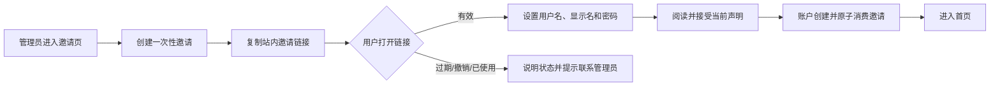
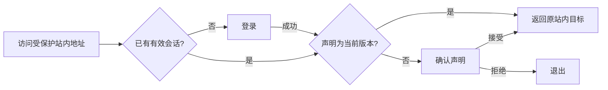
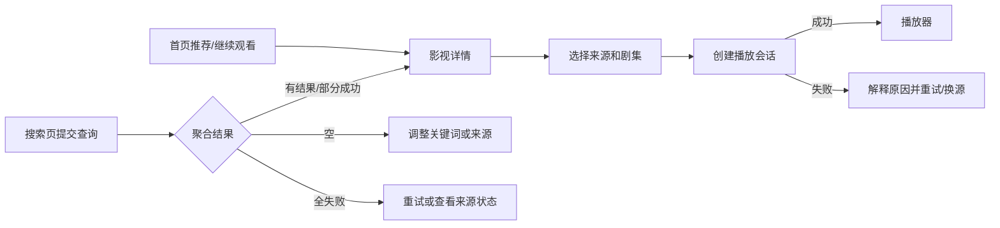
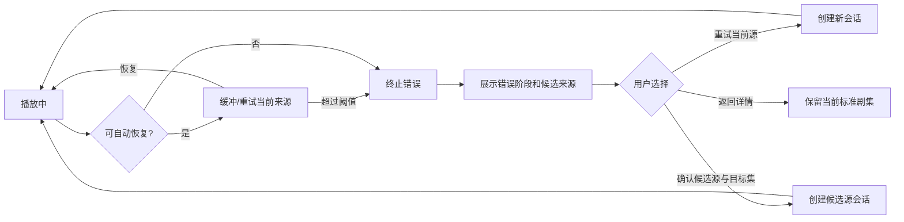
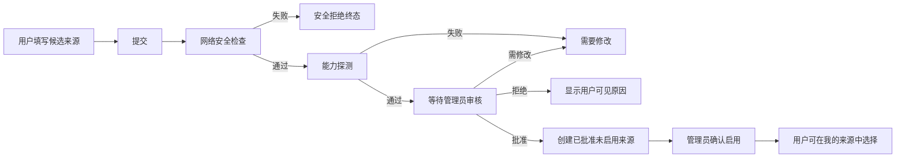
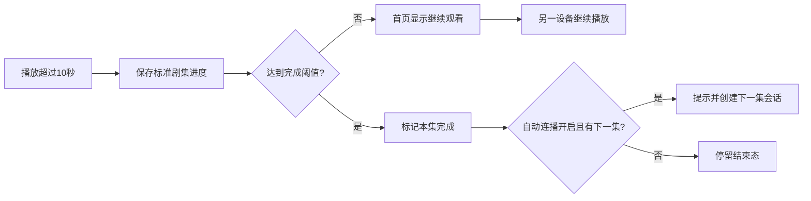
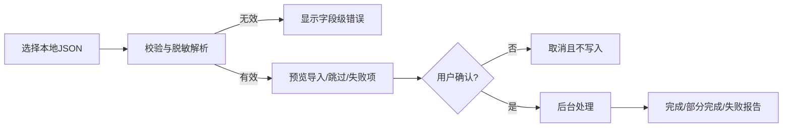
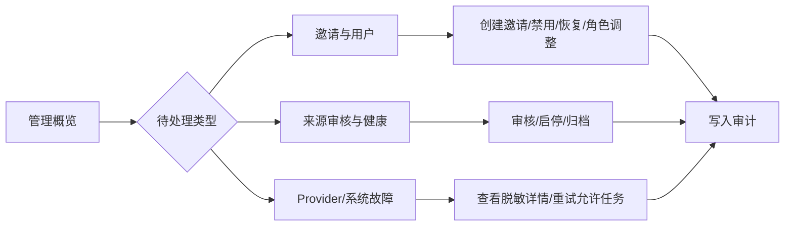

# V2 核心用户流程

> 版本：v0.1 草案  
> 日期：2026-07-13  
> 输入：[产品需求](../../product/product-requirements.md)、[状态机](../../product/state-machines.md)

## 流程一：管理员邀请用户

关键规则：邀请链接只显示一次完整值；管理员列表只显示摘要和状态；提交开户时若邀请刚被消费，用户停留在结果页而非重复创建。

## 流程二：登录与访问恢复

播放地址恢复到对应剧集页并重新创建播放会话，不恢复旧播放令牌。

## 流程三：发现、搜索到播放

搜索进行中发起新查询时取消旧任务；部分来源失败不遮挡成功结果。详情主按钮按“继续播放/开始播放”变化。

## 流程四：播放失败与手动换源

任何候选源都不能自动切换；无法精确匹配季/集时必须让用户确认目标集。

## 流程五：用户提交来源到管理员启用

安全检查不可被管理员绕过；修改通过新提交完成，旧记录保留；批准与启用是两个显式动作。

## 流程六：观看进度、收藏与历史

收藏独立于播放来源；删除历史不删除收藏，继续播放后可重新生成历史。

## 流程七：V1 数据导入

旧自定义源只转成候选提交；重复导入不重复创建；预览阶段不写业务数据。

## 流程八：管理员治理

最后一名有效管理员保护必须在禁用和降级确认框中直接说明；审计记录不可修改或删除。

## 跨流程中断规则

- 会话失效：保存可恢复的站内目标，登录后恢复；播放会话重新创建。
- 声明升级：阻断所有内容页面，接受后回到原目标。
- 用户被禁用：终止当前操作并退出，不展示账户是否存在等细节。
- 来源被暂停：禁止新搜索和播放会话，已有播放会话自然到期。
- 对象状态冲突：刷新到服务端最新状态，禁止旧页面覆盖审核或治理结果。
